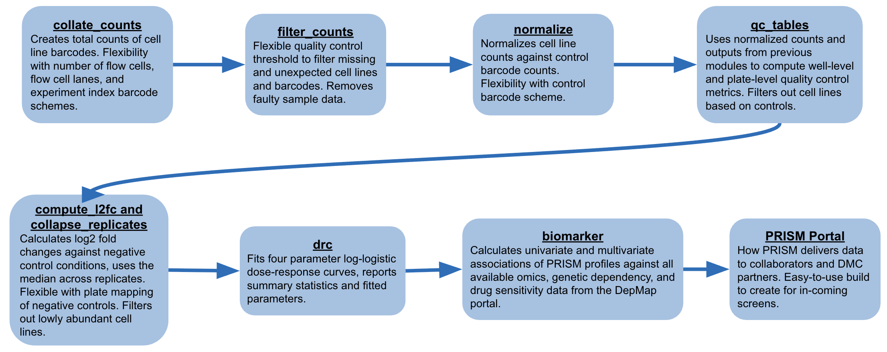

```{r toggle setup, echo=FALSE, results='asis'}
cat('
<style>
  .toggle-button {
    margin-left: 10px;
    font-size: 0.8em;
    cursor: pointer;
    background: #e7e7e7;
    border: none;
    padding: 2px 6px;
    border-radius: 4px;
  }
</style>

<script>
  document.addEventListener("DOMContentLoaded", function() {
    const headers = document.querySelectorAll("h2, h3");  // Change if needed
    headers.forEach(function(header) {
      // Create button
      const button = document.createElement("button");
      button.innerText = "Hide";
      button.className = "toggle-button";

      // Wrap all content until the next same-or-higher-level heading
      let contentWrapper = document.createElement("div");
      let next = header.nextElementSibling;
      while (next && !/^H[1-3]$/.test(next.tagName)) {
        let temp = next.nextElementSibling;
        contentWrapper.appendChild(next);
        next = temp;
      }
      header.parentNode.insertBefore(contentWrapper, next);

      // Insert button
      header.appendChild(button);

      // Toggle functionality
      button.addEventListener("click", function() {
        if (contentWrapper.style.display === "none") {
          contentWrapper.style.display = "";
          button.innerText = "Hide";
        } else {
          contentWrapper.style.display = "none";
          button.innerText = "Show";
        }
      });
    });
  });
</script>
')
```

```{r setup, include=FALSE}
knitr::opts_chunk$set(echo = FALSE)
```

# Sushi pipeline overview
**Sushi** is a processing pipeline that converts raw barcode counts from each flow cell and flow cell lane into normalized counts and log2 fold changes (L2FCs). First, in the **collate_fastq_reads** step, raw counts of PRISM barcodes are aggregated across flow cells and lanes. The **filter_counts** module maps each barcode to its corresponding cell line or control barcode sequence, categorizing them into expected and unexpected counts and producing per-sample counts for expected cell lines and controls. The **CB_normalize** step then normalizes raw cell line counts using a spiked-in control barcode ladder. Next, **compute_l2fc** calculates L2FCs for each cell line across treatment replicates. These are further collapsed in **collapse_replicates**, which computes L2FCs across replicates. **Dose_response** models dose–response curves using cell line viability (2^L2FC) for each treatment. Finally, L2FCs are analyzed to identify biomarkers through univariate and multivariate associations with DepMap data. The resulting outputs are partitioned by collaborator and shared via the PRISM Portal.



Sushi output files, their columns and definitions can be found on this spreadsheet. Columns sushi repeatedly uses to match cell line information are `depmap_id`, `lua`, `pool_id`, and `cell_set`.

# Getting started with Sushi
**Sushi** is the PRISM pipeline designed to process raw barcode counts from sequencing experiments. It follows a linear structure, with each step implemented as a separate module. Each module includes: (1) a Bash script to sequentially execute each pipeline step, (2) an R setup script containing the necessary parameters and inputs for the module, and (3) a core R script that defines the module’s main function. The Bash and setup R scripts are located in the `sushi/scripts/` directory, while the main function scripts reside in `sushi/scripts/src/`. Common utility functions used across modules are defined in `sushi/scripts/src/kitchen_utensils.R`.

The sushi pipeline github repository can be found at https://github.com/cmap/sushi/tree/main

This vignette is located in the `sushi/vignette/` folder.

Sample data used in this vignette is found on *<MTS 28 portal page to come>* using the encorafenib compound.

Formats of input files can be found *this will be an excel download, currently a GSheet*

### From sequencing output to pre-normalized counts
This section describes steps taken to prepare PRISM sequencing data for normalization. **These steps are for internal processing only, and documentation is provided for completeness.**


To generate barcode counts from DNA sequences, we use an internal pipeline. It processes FASTQ files received from our sequencing provider, demultiplexing data based on index barcodes which identify the PCR plate and PCR well of origin. The pipeline outputs raw barcode counts for each cell line barcode and spike-in control barcode per each flow cell and flow cell lane.

PRISM stores its cancer cell line information in an internal database, which has API calls in the pipeline.

To obtain the cumulative raw counts of each barcode detected in each sample across all flow cells and lanes, the **collate_fastq_reads** module (`sushi/scripts/collate_fastq_reads.R`) aggregates the counts. Barcodes are categorized as either recognized or unknown. A barcode is considered recognized if its sequence is present in the cell line or control barcode metadata.
Next, barcodes are mapped to their corresponding cell line or control barcode names and their undergone treatment conditions. The **filter_counts** module (`sushi/scripts/filter_counts.R`) associates barcodes in the recognized barcode file (`prism_barcode_counts.csv`) with their respective cell line or control identities. Barcodes not detected by the sequencer are assigned a count of zero, and then barcodes are flagged if they are expected to occur in the assay or not. Finally, the module removes any samples—such as specific cell lines, pools, or wells—that are known to be faulty or were unintentionally skipped by the automation system. 

# Data Processing

## Normalizing raw counts {.tabset}

### Description

To correct for amplification differences between wells, each PCR well contains 10 spiked-in control barcodes at known concentrations. In **CB_normalize** (`sushi/scripts/CB_normalize.R`), the raw counts obtained in each well are linearly proportional to the input amount of each barcode. The median of this proportionality factor is then used to scale raw counts in each well and obtain normalized counts. CB_normalize requires `filtered_counts.csv` and `CB_meta.csv` files as inputs. 

For each combination of PCR plate, PCR well, and control barcode dosage: the dose intercept (`dose_intercept`) is the difference between the mean known log2 dose of the control barcode and the mean log2 raw count (plus a pseudocount). Then, for each PCR plate and PCR well, compute the control barcode intercept (`cb_intercept`) as the median of the dose intercepts across all control barcodes in that well.

You may recreate the necessary input from your level 3 data or normalized and raw counts data download found on your PRISM Portal page and using the following commands in your terminal window:


### Example
```{r example normalization, echo = T, eval = F}
# Load into environment ----
require(magrittr)
require(tidyverse)
source("~/sushi/scripts/utils/kitchen_utensils.R")
source("~/sushi/scripts/normalize/normalize_functions.R")

# Set up inputs ----
filtered_counts <- data.table::fread("~/Desktop/data/vignette_test_data/data/filtered_counts.csv")
CB_meta <- data.table::fread("~/Desktop/data/vignette_test_data/data/CB_meta.csv")
pseudocount <- 20
input_id_cols <- c("pcr_plate", "pcr_well")

# Normalize your counts ----
normalized_counts = normalize(X = filtered_counts, 
                              id_cols = input_id_cols,
                              CB_meta = CB_meta, 
                              pseudocount = pseudocount)

```

IMAGE OF PRETTY CONTROL BARCODE LADDER FROM MTS of one well
```{r ex cb ladder, echo = F, eval = F}
from normalized counts outout make CB ladder from one well
```


## Filtering based on quality control {.tabset}

### General Description
At PRISM, we strive to deliver results with great quality and reliability from our screens. Through statistical explorations, our Analytics team has determined these quality control metrics and thresholds to improve the quality of screen results. Filtering cell lines and PCR wells starts with the **qc_tables module** (`sushi/scripts/src/qc_tables.R`).

### Measures of cell line quality {.tabset}

#### Description
The following four metrics define cell line failure on a particular PCR plate. The cell line may pass on other PCR plates containing treatment replicates. If only one replicate of the cell line passes across all PCR plates containing the cell line, then the cell is deemed to have failed at the pert plate (set of replicates that may be across PCR plate) level. Log2-viability data from passing cell lines are provided in downloads files. 

* The cell line is sufficiently abundant in the negative control condition (`nc_raw_counts_threshold`). In particular, a cell line needs to have a median raw count > 40 across negative control wells on the PCR plate

* Cell line variability (`nc_variability_threshold`) is low, i.e, the Median Absolute Deviation (MAD) of the log2-normalized counts of the cell line in negative control wells on the PCR plate is < 1

* The cell line is killed sufficiently in positive control (`pc_viability_threshold`), i.e., the median cell line viability across positive control wells on the PCR plate < 0.25

* Cell line killing is detected reliably (`error_rate_threshold`), i.e., the overlap of cell line signal between negative and positive control conditions on the PCR plate is small. This is quantified by the error rate of the optimal single threshold classifier between the log2-normalized counts in negative and positive control wells for the cell line. The error rate is defined as:

$$
ER = \frac{FPR + FNR}{2}
$$

where $FPR$ is the false positive rate and $FNR$ is the false negative rate. Specifically, for each cell line in a replicate plate, we identify the threshold log2-normalized counts value that minimizes the sum of errors, defined as the fraction of positive control log2-normalized counts replicates exceeding the threshold and the fraction of negative control log2-normalized counts replicates falling below it, and report the corresponding error rate.

#### Example
```{r example qc cell line, echo = T, eval = F}
# Load into environment ----
require(magrittr)
require(tidyverse)
source("~/sushi/scripts/utils/kitchen_utensils.R")
source("~/sushi/scripts/qc_tables/qc_table_functions.R")

# Set up inputs ----


# Compute cell line QC ----


```

### Measures of well quality {.tabset}

#### Description
The following three metrics define PCR well failure on a particular PCR plate. Passing wells have their data provided in normalized counts data.

* We filter out wells that do not have sufficient amplification, determined by a threshold on the median raw count of the control barcodes in the well. (We do not have a threshold on reads from cell lines since a strong treatment may kill all the cells.)

* We filter out wells that may have been contaminated or had PCR issues, determined by a threshold on the fraction of reads in a well that are associated with cell lines and control barcodes expected to be present in the well (`contamination_threshold`)

* We filter out wells where there may have been control barcode contamination, estimated by the linearity of the relationship between control barcode count and dose using Spearman correlation (`cb_spearman_threshold`) and Mean Absolute Error (`cb_mae_threshold`) on a logarithmic scale.

#### Example
```{r example qc well, echo = T, eval = F}
# Load into environment ----
require(magrittr)
require(tidyverse)
source("~/sushi/scripts/utils/kitchen_utensils.R")
source("~/sushi/scripts/qc_table/qc_table_functions.R")

# Set up inputs ----


# Compute well QC ----


```

## Calculating log2 fold changes {.tabset}

### Description

A PRISM screen incorporates multiple types of replicates to enhance the reliability, generalizability, and quality control of the results.

* **Biological replicates** (`bio_rep`) represent independent extractions of the same cell lines, all subjected to identical experimental conditions.

* **Technical replicates** (`tech_rep`) are repeated PCR reactions of the same biological sample under the same treatment conditions. 

Sushi first computes log2 fold changes (L2FCs) across technical replicates and then collapses these values into a summary for each biological replicate. To quantify cell line growth and sensitivity to treatments, the **compute_l2fc** (`sushi/scripts/compute_l2fc.R`) first takes the average across technical replicates. Then, the mean is taken since there are typically fewer technical replicates than biological replicates and there is less variability between technical replicates. Finally, log2 fold change is computed by comparing these means to those of the negative control samples, using the formula:
$$
L2FC = log_2( \frac{x_t}{x_{nc}}) 
$$

where $x_t$ is mean normalized counts across technical reps and
    $x_{nc}$ is the mean normalized counts of negative control taken across technical replicates, and then median across their biological replicates

### Example
```{r example l2fc, echo = T, eval = F}
# Load into environment ----
require(magrittr)
require(tidyverse)
source("~/sushi/scripts/utils/kitchen_utensils.R")
source("~/sushi/scripts/compute_l2fc/compute_l2fc_functions.R")

# Set up inputs ----
normalized_counts <- data.table::fread("~/Desktop/data/vignette_test_data/data/normalized_counts.csv")
control_type <- "ctl_vehicle"
sig_cols <- c("cell_set","pert_name","pert_dose","pert_dose_unit","day")
ctrl_cols <- c("cell_set", "day")
count_col_name <- "log2_normalized_n"
count_threshold <- 40
cell_line_cols <- c("lua", "depmap_id", "pool_id")

## For filtering failed cell lines
filter_failed_lines <- TRUE
qc_path <- data.table::fread("~/Desktop/data/vignette_test_data/data/qc_table.csv")
out <- "~/Desktop/data/vignette_test_data/data/"

# Calculated log2 fold changes
l2fc= compute_l2fc(normalized_counts = normalized_counts, 
                   control_type = control_type, 
                   sig_cols = sig_cols, 
                   ctrl_cols = ctrl_cols, 
                   count_col_name = count_col_name, 
                   count_threshold = count_threshold,
                   cell_line_cols = cell_line_cols)

# If filter_failed_lines is TRUE, filter out failed cell lines from the output file
if (args$filter_failed_lines) {
  # Write the unfiltered l2fc file
  print("Writing out unfiltered l2fc file ...")
  l2fc_unfiltered_outpath = paste(out, "l2fc_original.csv", sep= "/")
  write.csv(l2fc, l2fc_unfiltered_outpath, row.names= FALSE, quote= FALSE)
  
  # Read in QC file and filter lines that fail for an entire pert_plate
  join_cols = c(cell_line_cols, "pert_plate")
  qc_data = data.table::fread(qc_path, header= TRUE, sep= ',', data.table= FALSE)
  failed_lines_pert_plate = qc_data %>% filter(qc_pass_pert_plate == FALSE) %>% select(all_of(join_cols))

  l2fc = l2fc %>% anti_join(failed_lines_pert_plate, by= join_cols)
}

```

## Collapsing log2 fold changes across replicates {.tabset}

### Description
From L2FCs calculated in the previous module, **collapse_replicates** (`sushi/scripts/collapse_replicates.R`) uses L2FC and takes the median across biological replicates. This gives us one median L2FC per cell line in each treatment condition.


### Example
```{r example collapsed l2fc, echo = T, eval = F}
# Load into environment ----
require(magrittr)
require(tidyverse)
source("~/Desktop/sushi/scripts/utils/kitchen_utensils.R")
source("~/Desktop/sushi/scripts/collapse_replicates/collapse_replicates_functions.R")

# Set up inputs ----
l2fc <- data.table::fread("~/Desktop/data/vignette_test_data/data/l2fc.csv")
sig_cols <- c("cell_set","pert_name","pert_dose","pert_dose_unit","day")
cell_line_cols <- c("depmap_id", "lua", "pool_id")

# Collapsed l2fcs ----
collapsed_l2fc = collapse_bio_reps(l2fc = l2fc, 
                                  sig_cols = sig_cols, 
                                  cell_line_cols = cell_line_cols)
```

## Spliting based on projects

Although Sushi processes the entire screen—including all submitted compounds—in a single batch, collaborators are granted access only to their specific compounds and the screen’s validation compound. The PRISM Portal supports this internally by generating separate pages for each compound, with access restricted to designated collaborators. This is achieved using the x_project_id and pert_name columns (see definitions in the normalization section).
Note that this functionality is not handled within Sushi itself but is part of a separate pipeline responsible for building and managing the PRISM Portal pages.

# Downstream Analysis

## Dose response module {.tabset}

### General Description

The **dose_response** module (`sushi/scripts/dose_reponse.R`) fits 4-parameter dose-response curves (DRCs) to the viability (fold-change with respect to DMSO) of each cell line in all replicates that pass QC. The four parameters are upper limit ($UL$), lower limit ($LL$), slope ($s$), and inflection point ($EC50$).
The equation for the curve is defined as:

$$
f(x) = UL + \frac{LL-UL}{1 + \left(\frac{x}{EC50}\right)^s}
$$

### Additional details

The fit is perform with the following restrictions:

* For single agent studies, We support the predicted viability to decrease with increasing dose by constraining the slope parameter ($s$ < 1e-5). For combination studies, we relax this slope constraint since the two agents could be antagonistic.

* For single agent studies, we constrain the upper limit of the fit to be between 0.8 and 1.01. For combination studies, this constraint is relaxed as the viability at the anchor dose can be lower, and the upper limit of the fit is between 0 and 1.

* We constrain the lower limit of the fit to be between 0 and 1.

* We cap viabilities at 1.5 before fitting.

Since the nonlinear optimization underlying the curve fit can return a local optimum, we first fit the data using a number of different optimization methods and initial conditions implemented in the `drc` and `dr4pl` packages, and then report the fit with the smallest mean squared error (MSE). The `dr4pl` package provides a robust fit in some scenarios where the naive fit fails to converge.

The Area Under Curve (AUC) values are computed for each dose-response curve by integrating the numerical fit. IC50 values are computed only for the curves that drop below 50% viability. The Riemann AUC (AUCr) values are computed from the data points directly as the Riemann sum of the viabilities capped at 1:

$$
AUC_r = \frac{1}{n} \sum_{i=1}^{n}min(FC_i, 1) 
$$

where $FC_i$ is the fold change value, $i$ indexes the data point, and $n$ is the number of data points in the profile.
In scenarios where no fit converges, fit parameters for the cell line are not provided but the Riemann AUC is provided as it is independent of the fit.

### Example

```{r example drc, echo = T, eval = F}
# Load into environment ----
require(magrittr)
require(tidyverse)
source("~/Desktop/sushi/scripts/utils/kitchen_utensils.R")
source("~/Desktop/sushi/scripts/drc/dose_response_functions.R")

# Set up inputs ----
l2fc <- data.table::fread("~/Desktop/data/vignette_test_data/data/l2fc.csv")
cell_line_cols <- c("depmap_id", "lua", "pool_id")
sig_cols <- c("cell_set","pert_name","pert_dose","pert_dose_unit","day")
dose_col <- "pert_dose"
l2fc_column <- "l2fc"
type_col <- "pert_type"
cap_for_viability <- 1.5

# Create treatment_columns by removing column names containing "dose" ----
treatment_cols <- union(
  sig_cols[grepl("pert", sig_cols) & !grepl("dose", sig_cols)],
  sig_cols[sig_cols == "day"]
)

# FIT DRC curves ----
dose_response= create_drc_table(LFC= l2fc,
                                cell_line_cols= cell_line_cols,
                                treatment_cols= treatment_cols,
                                dose_col= dose_col,
                                l2fc_column= l2fc_column,
                                type_col= type_col,
                                cap_for_viability= cap_for_viability)


```

If an error message occurs similar to

`Error in optim(startVec, opfct, hessian = TRUE, method = "L-BFGS-B", lower = lowerLimits,  : 
  L-BFGS-B needs finite values of 'fn'`
  
this is due to the the curve not being able to be fitted for some cell line due to factors like too few replicates or to big of a difference between replicate results.

## Identifying biomarkers

### Univariate biomarker analysis {.tabset}

#### Description

For univariate biomarker analysis with continuous features (e.g. CRISPR dependency, expression, etc.), we calculate the Pearson correlation and corresponding p-values. For univariate biomarker analysis with discrete features (e.g. mutations, lineage, etc.), we calculate the effect size as the regression coefficient against the binary feature and provide corresponding p-values. Multiple hypothesis correction is computed using the Benjamini-Hochberg procedure to provide q-values

#### Example
```{r example univariate biomarker, echo = T, eval = F}
# Load into environment ----
require(magrittr)
require(tidyverse)
source("~/sushi/scripts/utils/kitchen_utensils.R")
source("~/sushi/scripts/biomarker/biomarker_functions.R")

# Set up inputs ----
#h5 file from taiga

# Calculate biomarkers ----
#h5 file from taiga

```

### Multivariate biomarker analysis {.tabset}

#### Description

For each log2 viability at each dose (including $log_2AUC$), multivariate models are trained and fit using the molecular characterizations and genetic dependencies of the PRISM cell lines. The resulting importance of various features can be used to suggest potential biomarkers of compound response or to inform potential hypotheses for mechanisms of action. The dose or curve-level statistic used is noted in the “Dose” column.

Random forest models are trained using:
CCLE model: Cancer Cell Line Encyclopedia (CCLE) features (copy number alterations, RNA expression, mutation status and lineage annotation)
Complete model: Cancer Cell Line Encyclopedia (CCLE) features + reverse phase protein array data (RPPA) + CRISPR + miRNA + metabolomics (MET).
For each feature of each model, feature importance is computed after normalization (the sum of the importances is set to 1 in each model) and tabulated along with the accuracy measures. High variable importance and high accuracy for a given feature suggests that it is important for predicting sensitivity (at the given dose modeled). The feature importances are not directional quantities. 

#### Example

```{r example multivariate biomarker, echo = T, eval = F}
# Load into environment ----
require(magrittr)
require(tidyverse)
source("~/sushi/scripts/utils/kitchen_utensils.R")
source("~/sushi/scripts/biomarker/biomarker_functions.R")

# Set up inputs ----
#h5 file

# Calculate biomarkers ----


```

## Frequently asked questions

*Some FAQs should be added here*


## R environment information

```{r}
utils:::print.sessionInfo(sessionInfo()[c(-10)])
```


